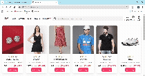

# 🛍️ SnapWear – E-Commerce Project (HTML, CSS, JavaScript)

A responsive e-commerce web application inspired by Myntra. SnapWear allows users to browse products, add them to a shopping bag, and view the total bill dynamically.

## 🚀 Features

- **Responsive Design:** Mobile-friendly layout inspired by popular e-commerce platforms.  
- **Add to Bag:** Users can add products to their shopping bag.  
- **Bag Page:** View all added products with details and pricing.  
- **Billing System:** Dynamically calculates the total price of items in the bag.  
- **Remove from Bag:** Easily remove unwanted items from the shopping bag.  

## 🖥️ Tech Stack

- **HTML5:** Website structure.  
- **CSS3:** Styling, layout, and responsive design.  
- **JavaScript (ES6):** Interactive functionality like adding/removing items and updating the bill.

## 🎬 Demo

[📹 Full Video Demo](./Demo.mp4)
